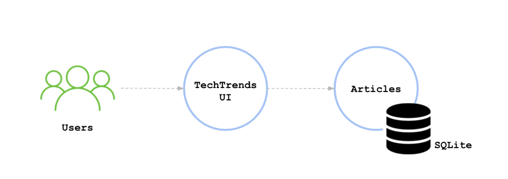
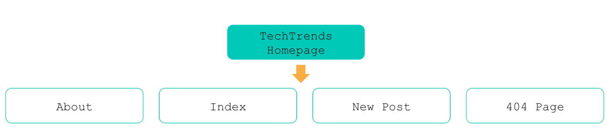
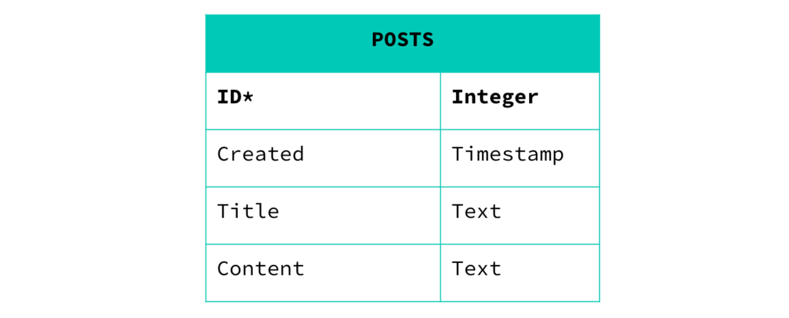
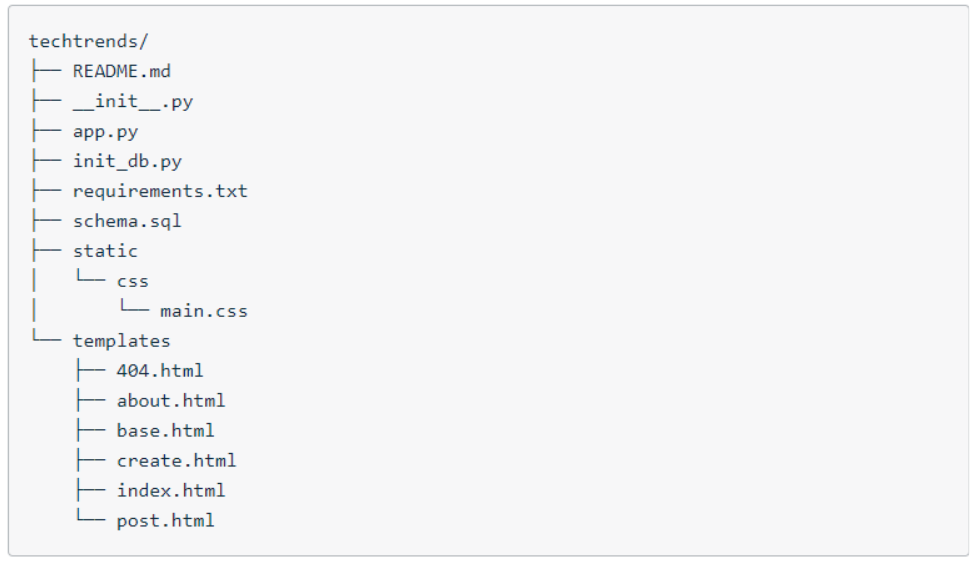

# Overview

TechTrends is an online website used as a news sharing platform, that enables consumers to access the latest news within the cloud-native ecosystem. In addition to accessing the available articles, readers are able to create new media articles and share them.

Imagine the following scenario: We joined a small team as a Platform Engineer. The team is composed of 2 developers, 1 platform engineer (you), 1 project manager, and 1 manager. The team was assigned with the TechTrends project, aiming to build a fully functional online news sharing platform. The developers in the team are currently working on the first prototype of the TechTrends website. As a platform engineer, we should package and deploy TechTrends to Kubernetes using a CI/CD pipeline.

The web application is written using the Python Flask framework. It uses SQLite, a lightweight disk-based database to store the submitted articles.

Below we can examine the main components of the firsts prototype of the application:

Additionally, the initial sitemap of the website can be found below:

Where:

- About page - presents a quick overview of the TechTrends site
- Index page - contains the content of the main page, with a list of all available posts within TechTrends
- New Post page - provides a form to submit a new post
- 404 page - is rendered when an article ID does not exist is accessed
- And lastly, the first prototype of the application is storing and accessing posts from the "POSTS" SQL table. A post entry contains the post ID (primary key), creation timestamp, title, and content. The "POSTS" table schema can be examined below:

# Getting Started
This repository file structure can be found below:

Where:

- README.md contains the main steps of how to execute the TechTrends application
- __init__.py is a reserved method used to indicate that a directory is a Python package
- app.py contains the main logging of the TechTrends application
- init_db.py is a file that is used to initialize the posts database with a set of articles
- requirements.txt contains a list of packages that need to be installed before running the TechTrends application
- schema.sql outlines the posts database schema
- static/ folder contains the CSS files
- templates/ folder outlines the HTML structure of the TechTrends application

Within the project folder we will notice some extra folders and files. These will be used to record our commands and output screenshots.

- argocd - the folder that will contain the ArgoCD manifests
- helm - the folder that will contain the Helm chart files
- kubernetes - the folder that will contain Kubernetes declarative manifests
- screenshots - the folder that will contain all the screenshots that you take throughout the course
- Vagrantfile - the file containing the configuration for the vagrant box. Will be used to create a vagrant box locally.
- docker_commands - the file will be used to record any used Docker commands and outputs

To run this application follow these steps:

1. Initialize the database by using the python init_db.py command. This creates or overwrites (if the file already exists) the database.db file that is used to store and access the available posts.
2. Run the TechTrends application by using the python app.py command. The application is running on port 3111 and you can access it by querying the http://127.0.0.1:3111/ endpoint.

# Dependencies

1. Fork the [course repository](https://github.com/udacity/nd064_course_1/tree/main/project) containing the Techtrends application.
2. Python 3.6 or higher
3. Git
4. Docker
5. Vagrant 
6. VirtualBox 6.1.16 or higher

# Project Steps Overview
1. Apply the best development practices and develop the status and health check endpoints for the TechTrends application.
2. Package the TechTrends application by creating a Dockefile and Docker image.
3. Implement the Continuous Integration practices, by using GitHub Actions to automate the build and push of the Docker image to DockerHub.
4. Construct the Kubernetes declarative manifests to deploy TechTrends to a sandbox namespace within a Kubernetes cluster. The cluster should be provisioned using k3s in a vagrant box.
5. Template the Kubernetes manifests using a Helm chart and provide the input configuration files for staging and production environments.
6. Implement the Continuous Delivery practices, by deploying the TechTrends application to staging and production environments using ArgoCD and the Helm chart.

# Step 1:

## Best Practices For Application Deployment
